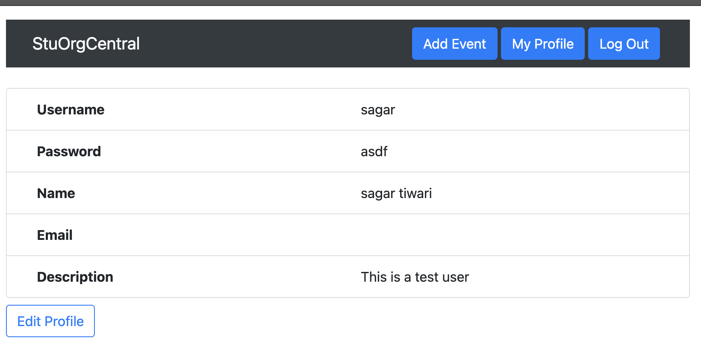

# StuOrgCentral

**This web application was submitted for a CSCI201 Final Project in Fall 2020.**

StuOrgCentral is a web application that allows USC students to filter and find RSO Events. This application was implemented using MERN Stack (MongoDB, Express, React, Node), and includes features such as keyword search, multilevel roles & permissions, real time alerts, and complete CRUD functionality.

****
# Homepage (Guest Permissions)
Here is the standard home page, complete with a search bar and details buttons for events.

****
# Homepage (User Permissions)
Here is the home page for a registered user. As you can see, users have the additional capability of adding, editing, and deleting events. 

****
# Edit Event
When adding or editing an event, users must fill in a few mandatory fields (such as the name). However, other fields, such as a description, can be left blank. Users can also add keywords, which attach to the event object and become included as a search term.

 
****
# Search
Here is an example of a search request. As you can see, "rpl" was inputted as a search, yielding the following list of events. While all events do not have the term "rpl" in the name, the acronym was added as a keyword to all of the following events as a test. 

****
# Profile
Here is what the profile page looks like. Users can edit their data, changing all of their fields. Our backend provides extensive error checking and will ensure that no two users have identical usernames.

